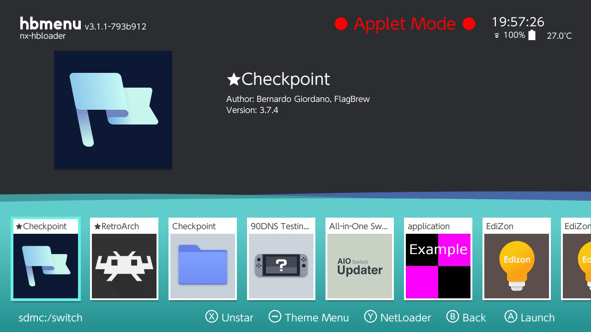
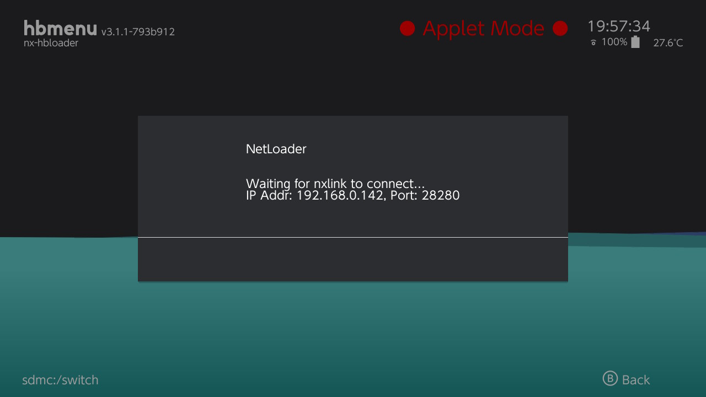
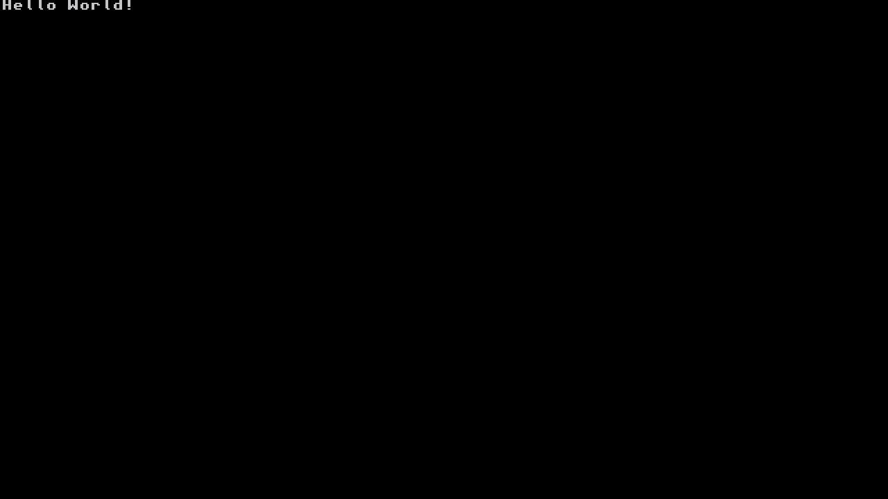
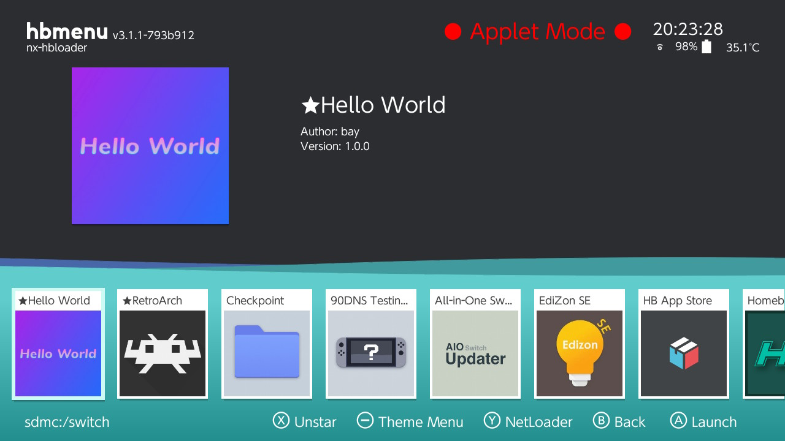

# Switch Homebrew Template

<p align="center">
  
</p>

Hello World template for switch homebrew development.

## Requirements

Switch with CFW([SX OS](https://sx.xecuter.com/), [Atmosphere](https://github.com/Atmosphere-NX/Atmosphere))

[devkitPro](https://github.com/devkitPro/installer/releases)

[hbmenu](https://github.com/switchbrew/nx-hbmenu)

## Build
```sh
make
```

## Build using docker
```sh
./scripts/build-docker-image.sh #builds the docker switchdev image local

./build.sh #builds the app using the docker image ghcr.io/bay0/switch-homebrew-template:latest
```

## Test Homebrew via [hbmenu](https://github.com/switchbrew/nx-hbmenu)

1. Start [hbmenu](https://github.com/switchbrew/nx-hbmenu) on your CFW Switch

<p align="center">
  
</p>

2. Press Y to use the NetLoader

<p align="center">
  
</p>

3. Run [nxlink](https://wiidatabase.de/switch-downloads/pc-tools/nxlink/)
    ```sh
    nxlink -s -a 192.168.XXX.XXX out\<homebrew_name>.nro
    ```

4. 

<p align="center">
  
</p>

<p align="center">
  
</p>

## Contributing
Pull requests are welcome. For major changes, please open an issue first to discuss what you would like to change.

Please make sure to update tests as appropriate.

## License
[MIT](https://github.com/bay0/switch-homewbrew-template/blob/master/LICENSE)